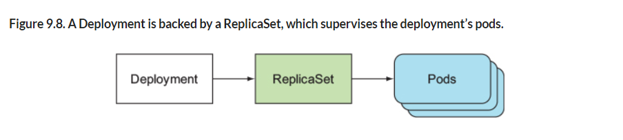
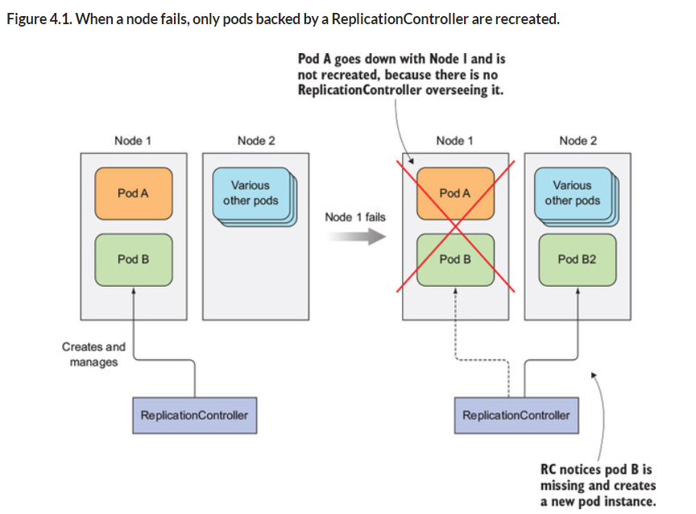

# **Running SPA on minikube**

This project was generated with [Angular CLI](https://github.com/angular/angular-cli) version 15.1.4.

## Table of contents

- [**Running SPA on minikube**](#running-spa-on-minikube)
  - [Table of contents](#table-of-contents)
  - [Prerequisites and Installation](#prerequisites-and-installation)
    - [Installation](#installation)
  - [Quick start](#quick-start)
    - [Running SPA on Docker Container](#running-spa-on-docker-container)
    - [Running SPA on minikube](#running-spa-on-minikube-1)
    - [Deploy and Access web application running on pod using loadbalancer](#deploy-and-access-web-application-running-on-pod-using-loadbalancer)
    - [Deploy a pod with two containers, each running a different application.](#deploy-a-pod-with-two-containers-each-running-a-different-application)
    - [Deploy MYSQL Database](#deploy-mysql-database)
    - [Canary Deployment](#canary-deployment)
    - [A/B Deployment](#ab-deployment)
    - [Blue-Green Deployment](#blue-green-deployment)
    - [Ingress Controller](#ingress-controller)
    - [Deploy using Helm Chart](#deploy-using-helm-chart)
    - [Deploy using Terraform](#deploy-using-terraform)
      - [How to Access Pod using Host Name](#how-to-access-pod-using-host-name)
    - [Cleanup](#cleanup)
    - [Namespace](#namespace)
    - [Linting Kubernetes Manifest](#linting-kubernetes-manifest)
  - [Knowledge](#knowledge)
    - [Pod vs Deployment:](#pod-vs-deployment)
    - [Pods:](#pods)
    - [Deployment:](#deployment)
    - [Service](#service)
    - [ConfigMap](#configmap)
    - [DaemonSet and StatefulSet](#daemonset-and-statefulset)
      - [DaemonSet](#daemonset)
      - [StatefulSet](#statefulset)
    - [Probes in Kubernetes](#probes-in-kubernetes)
    - [Namespace](#namespace-1)
  - [Kubernetes ImagePullBackOff error: what you need to know](#kubernetes-imagepullbackoff-error-what-you-need-to-know)

## Prerequisites and Installation

Library | Version | Notes
:-------|:--------:|-------
[Node](https://nodejs.org/) | 16.17.x | Recommended NodeJS version
[NPM](https://nodejs.org/) | 8.15.x | Recommended NPM version
[Angular](https://angularjs.org/) | 15.1.x | JavaScript-based open-source front-end SPA framework
[Angular CLI](https://cli.angular.io/)| ~15.1.x | Angular tool to create, manage and run build tasks
[Minikube](https://minikube.sigs.k8s.io/docs/start/)| v1.29.0 | Lightweight Kubernetes implementation that creates a VM on your local machine and deploys a simple cluster containing only one node

### Installation

1. Install Node v16.17.x and NPM v8.15.x

2. Install Angular cli

```bash
// uninstall older version of Angular CLI
     npm uninstall -g @angular/cli
// To get the latest production version of Angular CLI 12.2.x
     npm install @angular/cli@12.2 -g
// Verify the angular cli and workspace versions
     ng --version
```

3. Install minikube, refer: https://minikube.sigs.k8s.io/docs/start/

## Quick start

1. Clone repository and enter it

  ```bash
  git clone git@github.com:kumaran-is/demo-spa.git
  cd demo-spa
  ```

2. Install NPM

  ```bash
  npm install
  ```

3. Start the spa and navigate to <http://localhost:4200/>.

```bash
npm run start

```

This command starts Angular UI application on port `4200`

### Running SPA on Docker Container

1. We run SPA on a nginx server on port `8000`  inside the container. Lets create a [custom nginx configuration](./nginx-custom.conf) which will be used by nginx docker image in step 2


2. Write a multi-stage [docker file](./Dockerfile). Dockerfile consists of two stages:

First stage: Create a node environment using node 16.17 base image and builds the angular application with production configuration.

Second stage: Copy the dist folder from the previous stage to Nginx container and copy [custom nginx configuration](./nginx-custom.conf)inside the nginx


3. Build docker image

```
docker build -t kumaranisk/spa-demo:v1 .
```

4. Verify the created image

```
docker images -a
```

5.  Run docker image. This will start the SPA on docker container at ngnix port `8000`

```
docker run -it -p 8000:8000 kumaranisk/spa-demo:v1
```

6.  Launch the application by navigating to <http://localhost:8000>

7.  Stop and remove the container

```
docker ps -a
docker stop <container_id>
docker rm <container_id>
```

8. To remove container upon exit, pass argument "--rm" to docker run command

```
docker run -it -p 8000:8000 --rm kumaranisk/spa-demo:v1
```

### Running SPA on minikube

1. Login to docker to publish docker image `kumaranisk/spa-demo:v1` to public `https://hub.docker.com/` registry using your docker hub `user id` and `password`

```
docker login --username=kumaranisk
# enter your docker hub password when prompt
```

2. Docker push to docker registry

```
docker push kumaranisk/spa-demo:v1
```

3. start the minikube

```
minikube start
or
# To run more than one nodes i.e 2 nodes
minikube start --nodes 2 -p multinode-demo

```

4. Enable `metrics-server` addon to show metrics on dashboard

```
minikube addons enable metrics-server

```

5. start the minikube dashboard

```
minikube dashboard
or
# For mulit-node Refer : https://minikube.sigs.k8s.io/docs/tutorials/multi_node/
minikube dashboard -p multinode-demo 
```

6. check the status of the nodes

```
minikube status
or
docker ps
or
minikube status -p multinode-demo
```

7. check the config

```
kubectl config view
```

8. check the namespace

```
kubectl get ns
```

9. Get the pods of the given namespace

```
kubectl get po -n kube-system
```

10. Get list of all the api resources

```
kubectl api-resources
kubectl api-resources --namespaced=false
```

11. Get the list of nodes

```
kubectl get nodes
or
kubectl get no -o wide
```

12. Get top nodes metrics

```
kubectl top nodes
or
kubectl top no -o wide
```

13. To get details of your cluster, by running the following command:
   
```
 kubectl cluster-info
```

14. Optional step: Instead of pushing the docker image to docker hub, you can sync local docker registry with minikube. You need to create docker image again after firing below command.

```
eval $(minikube -p minikube docker-env)
// unsync 
eval $(minikube -p minikube docker-env --unset)
```

15. Create a [kubernetes Deployment Pod resource](./spa-deployment.yaml). A Deployment named `demo-deployment` is created, indicated by the .metadata.name field. This name will become the basis for the ReplicaSets and Pods which are created later. You can find the sample template for Deployment file in the [official website](https://kubernetes.io/docs/concepts/workloads/controllers/deployment/)

16. Create the deployment by running the following command on deployment manifest file:
   
```
 kubectl apply -f spa-deployment.yaml
 or
 # use --record flag to display the cause of the when we run kubectl rollout history
 kubectl apply -f spa-deployment.yaml --record
 
```

17. Check if the Deployment was created:
   
```
 kubectl get deployments
```

18. To see the Deployment rollout status:
   
```
 kubectl rollout status deployment/demo-deployment
 or
 kubectl rollout status deployment/demo-deployment-multi
```

19. To see the history of Deployment rollout :
   
```
 kubectl rollout history deployment/demo-deployment
 or
 kubectl rollout history deployment/demo-deployment-multi
```


20. To rollback to previous version :
   
```
 kubectl rollout undo deployment/demo-deployment
```

21. To get details of your Deployment, by running the following command:
   
```
 kubectl describe deployments
```

22. To see the pods created, by running the following command:
   
```
 kubectl get pods -A # get all pods from all the namespace
 or
 kubectl get po
 or
 kubectl get po -o wide
```

23. To get details of your pods, by running the following command:
   
```
 kubectl describe po
```

24. To get list of network namspace, by running the following command:
   
```
 ip netns list
```

25. To get labels of your pods, by running the following command:
   
```
 kubectl get po --show-labels
```

26. Get application logs, by running the following command:
   
```
 kubectl logs <podname>
 // when running more than one container in a pod
 kubectl logs -f <podname> -c <containername>
```

27.  Create a [kubernetes service resource](./spa-service.yaml). In Kubernetes, a Service is an abstraction which expose an application running on a set of Pods as a network service. The set of Pods targeted by a Service is usually determined by a selector label `demo`.  For example, in deployment resource we defineda set of Pods where each listens on TCP port `8000` and contains a label `demo`. You can find the sample template for service file in the [official website](https://kubernetes.io/docs/concepts/services-networking/service/)

28. Create the service by running the following command on service manifest file:
   
```
 kubectl apply -f spa-service.yaml
```

29. Check if the service was created:
   
```
 kubectl get svc
 or
 kubectl get svc -o wide
```

30. Look at our service, to know what URL to hit, by running the following command:
   
```
 minikube service list
 or 
 minikube service list -p multinode-demo
```

31. To get details of your services, by running the following command:
   
```
 kubectl describe services
```

32. To get all resources created, by running the following command:
   
```
 kubectl get all
```

33. To get details of your cluster, by running the following command:
   
```
 kubectl cluster-info
```

34. To get node ip:
   
```
 minikube ip

 or

kubectl get no -o wide
```

35.  To launch the application:
Note: Known issue - Minikube IP not accessible: If you can't access the NodePort service webapp with `MinikubeIP:NodePort`, execute the following command:
   
```
 minikube service demo-spa-service
 
 or

minikube service demo-spa-service --url 
```

36. To avoid running command on every Yaml file, you can run the kubectl apply command on the entire folder where they are located
   
```
kubectl apply -f ./k8s
```
Note: You can use helm to avoid creating large number of YAML files. Helm is a package manager for Kubernetes. It helps deploy complex application by bundling necessary resources into Charts, which contains all information to run application on a cluster.

### Deploy and Access web application running on pod using loadbalancer 

To access the web application through the LoadBalancer service in a Minikube cluster, you will need to use the Minikube's built-in load balancer support.


1. Create the deployment by running the following command on deployment manifest file:
   
```
 kubectl apply -f spa-deployment.yaml
```

2. Check if the Deployment was created:
   
```
 kubectl get deployments
```

3. To see the Deployment rollout status:
   
```
 kubectl rollout status deployment/demo-twins-deployment

```

4. To get details of your Deployment, by running the following command:
   
```
 kubectl describe deployments
```

5. To see the pods created, by running the following command:
   
```
 kubectl get pods -A # get all pods from all the namespace
 or
 kubectl get po
 or
 kubectl get po -o wide
```

6. To get details of your pods, by running the following command:
   
```
 kubectl describe po
```

7. Create the service type:loadbalancer by running the following command on service manifest file:
   
```
 kubectl apply -f spa-load-balancer-service.yaml
```

8. Check if the service was created:
   
```
 kubectl get svc
 or
 kubectl get svc -o wide
```

9. To get details of your services, by running the following command:
   
```
 kubectl describe services
 or
 kubectl describe service demo-loadbalancer
```

10.  To launch the application, execute the following command:
   
```
 minikube service demo-loadbalancer
 
 or

minikube service demo-loadbalancer --url 
```

### Deploy a pod with two containers, each running a different application.

Create two containers, `demo-twins-spa-container` and `test-twins-spa-container`, running different images. Each container is exposed on a different port.

1. Create the deployment by running the following command on deployment manifest file:
   
```
 kubectl apply -f spa-deployment3.yaml
```

2. Check if the Deployment was created:
   
```
 kubectl get deployments
```

3. To see the Deployment rollout status:
   
```
 kubectl rollout status deployment/demo-twins-deployment

```

4. To get details of your Deployment, by running the following command:
   
```
 kubectl describe deployments
```

5. To see the pods created, by running the following command:
   
```
 kubectl get pods -A # get all pods from all the namespace
 or
 kubectl get po
 or
 kubectl get po -o wide
```

6. To get details of your pods, by running the following command:
   
```
 kubectl describe po
```

7. Create the service by running the following command on service manifest file:
   
```
 kubectl apply -f spa-service3.yaml
```

8. Check if the service was created:
   
```
 kubectl get svc
 or
 kubectl get svc -o wide
```

9. Look at our service, to know what URL to hit, by running the following command:
   
```
 minikube service list
```

10. To get details of your services, by running the following command:
   
```
 kubectl describe services
```

11. To get details of your cluster, by running the following command:
   
```
 kubectl cluster-info
```

12. To get node ip:
   
```
 minikube ip

 or

kubectl get no -o wide
```

13.  To launch the application:
Note: Known issue - Minikube IP not accessible: If you can't access the NodePort service webapp with `MinikubeIP:NodePort`, execute the following command:
   
```
 minikube service demo-twins-service
 
 or

minikube service demo-twins-service --url 
```

### Deploy MYSQL Database 

To access the web application through the LoadBalancer service in a Minikube cluster, you will need to use the Minikube's built-in load balancer support.

1. Go to `./k8s/mysql`:
   
```
 cd ./k8s/mysql
```

2. Create the configmaps for MYSQL database by running the following command:
   
```
 kubectl apply -f mysql-configMap.yaml
```

3. Check if the configmaps was created:
   
```
 kubectl get configmaps
 or
 kubectl get configmaps -o wide
```

4. To get details of your configmaps, by running the following command:
   
```
 kubectl describe configmaps
 or
 kubectl describe configmaps mysql-config
```

5. Tokes/Password should be always encrypted or encoded to base64 and store it in secrets. You can encode a string value to base64 by running below command:

```
 echo -n 'root' | base64 
```

6. Create the secrets for MYSQL database by running the following command:
   
```
 kubectl apply -f mysql-secret.yaml
```

7. Check if the secrets was created:
   
```
 kubectl get secrets
 or
 kubectl get secrets -o wide
```

8. To get details of your secrets, by running the following command:
   
```
 kubectl describe secrets
 or
 kubectl describe secrets mysql-secret
```

9. Create the PersistentVolumeClaim for MYSQL database by running the following command:
   
```
 kubectl apply -f mysql-pvc.yaml
```

10. Check if the pvc was created:
   
```
 kubectl get pvc
 or
 kubectl get pvc -o wide
```

11. To get details of your pvc, by running the following command:
   
```
 kubectl describe pvc
 or
 kubectl describe pvc mysql-pvc
```

12. Create the mysql database deployment by running the following command on:
   
```
 kubectl apply -f mysql-deployment.yaml
```

13. Check if the Deployment was created:
   
```
 kubectl get deployments
```

14. To see the Deployment rollout status:
   
```
 kubectl rollout status deployment/mysql-deployment
```

15. To see the history of Deployment rollout :
   
```
 kubectl rollout history deployment/mysql-deployment
```


16. To get details of your Deployment, by running the following command:
   
```
 kubectl describe deploy mysql-deployment
```

17. To see the pods created, by running the following command:
   
```
 kubectl get pods -A # get all pods from all the namespace
 or
 kubectl get po
 or
 kubectl get po -o wide
```

18. To get details of your pods, by running the following command:
   
```
 kubectl describe po
```

19. Create the service for MYSQL database by running the following command:
   
```
 kubectl apply -f mysql-service.yaml
```

20. Check if the service was created:
   
```
 kubectl get svc
 or
 kubectl get svc -o wide
```

21. To get details of your services, by running the following command:
   
```
 kubectl describe services
 or
 kubectl describe service mysql-service
```

22. To verify database instance, go to pod by running the following command:
   
```
 kubectl exec -it <podname> /bin/bash

```

23. Login to MYSQL by running the following command:
   
```
 mysql -h mysql -u root -p

```
Note: It will prompt for password, enter database password

24. Verify the database name by running the following command:
   
```
 show database

```
This command will display the database name as  `employer`

### Canary Deployment

Canary deployments involve gradually rolling out a new version of an application to a small subset of users before releasing it to the entire user base. This helps you to test the new version and identify potential issues before they affect a large number of users.

In this flow, you create a service type`NodePort` to allow access to all created pods or replicas through a single IP or name, as it abstracts away the individual pod addresses to a specific service name and allows requests within the cluster to reach multiple pods. 

In this example, the main deployment(`spa-deployment.yaml`) `demo-deployment` has 5 replicas and uses image version v1, while the canary deployment(`spa-deployment-canary.yaml`) `demo-deployment-canary` has 1 replica and uses image version v2. The service routes traffic to both deployments by using a selector that matches the `demo` label. The canary deployment allows you to test the new version of the application before releasing it to the entire user base.

In this case, we have a 5:1 ratio for stable:canary, so 20% of requests hitting the load balancer will get the Canary release.

**Option 1:**
Once Canary version`kumaranisk/spa-demo:v2` is tested and approved, we can proceed by switching the Docker image used in `spa-deployment-stable.yaml` to `kumaranisk/spa-demo:v2` and then simply re-apply the configuration. Another route would be to save the image used directly to the k8s API:

```
$ kubectl set image deployment/demo-deployment demo-spa-container=kumaranisk/spa-demo:v2
```
**Option 2:**
we’re using the NGINX ingress, letting Kubernetes know that this ingress is canary and that `20%` of the requests are expected to go to the service `demo-spa-canary-service`.

Once Canary version`kumaranisk/spa-demo:v2` is tested and approved

One way to tackle both issues is by creating new stages in your continuous delivery pipelines. The first thing to do can be defining targets like 5%, 25%, 50%, and 100% and manually playing some or each of them.

When we reach 100% of traffic on canary, this means that the stable flow should switch to the canary version and canary is now at 0%.

There’s also Flagger, a Kubernetes operator that helps on canary deployments.

1. Create the deployment by running the following command on deployment manifest file:
   
```
cd k8s/canary
kubectl apply -f spa-deployment.yaml
kubectl apply -f spa-deployment-canary.yaml
```

2. To get details of your Deployment, by running the following command:
   
```
 kubectl describe deployments
```

3. To see the pods created, by running the following command:
   
```
 kubectl get pods -A # get all pods from all the namespace
 or
 kubectl get po
 or
 kubectl get po -o wide
```

4. To get details of your pods, by running the following command:
   
```
 kubectl describe po
```

5. Create the service type `NodePort` by running the following command :
   
```
 kubectl apply -f spa-service-canary.yaml
```

6. Check if the service was created:
   
```
 kubectl get svc
 or
 kubectl get svc -o wide
```

7.  To launch the application:
Note: Known issue - Minikube IP not accessible: If you can't access the NodePort service webapp with `MinikubeIP:NodePort`, execute the following command:
   
```
 minikube service demo-spa-canary-service
 
 or

minikube service demo-spa-canary-service --url 
```

### A/B Deployment

A/B deployments are similar to blue-green deployments, but instead of having two separate environments, both versions of the application run within the same environment and traffic is split between them to perform a comparison.

It also allows you to compare the behavior of both versions of the application, test the reception of new features, and how they behave in your production environment. You can tweak the percentage of users that will experience the updates, create experiments, and carry out monitored A/B tests to ensure the final version of your application is the best it can be.

In this flow, you create a service type`NodePort` to allow access to all created pods or replicas through a single IP or name, as it abstracts away the individual pod addresses to a specific service name and allows requests within the cluster to reach multiple pods. 

In this example, the A deployment(`spa-deployment-a.yaml`) `demo-deployment-a` has 3 replicas and uses image version v1, while the B deployment(`spa-deployment-b.yaml`) `demo-deployment-b` has 2 replicas and uses image version v2. The service routes traffic to both deployments by using a selector that matches the `demo` label. The canary deployment allows you to test the new version of the application before releasing it to the entire user base.

1. Create the deployment by running the following command on deployment manifest file:
   
```
cd k8s/ab
kubectl apply -f spa-deployment-a.yaml
kubectl apply -f spa-deployment-b.yaml
```

2. To get details of your Deployment, by running the following command:
   
```
 kubectl describe deployments
```

3. To see the pods created, by running the following command:
   
```
 kubectl get pods -A # get all pods from all the namespace
 or
 kubectl get po
 or
 kubectl get po -o wide
```

4. To get details of your pods, by running the following command:
   
```
 kubectl describe po
```

5. Create the service type `NodePort` by running the following command :
   
```
 kubectl apply -f spa-service-ab.yaml
```

6. Check if the service was created:
   
```
 kubectl get svc
 or
 kubectl get svc -o wide
```

7.  To launch the application:
Note: Known issue - Minikube IP not accessible: If you can't access the NodePort service webapp with `MinikubeIP:NodePort`, execute the following command:
   
```
 minikube service demo-spa-ab-service
 
 or

minikube service demo-spa-ab-service --url 
```

### Blue-Green Deployment

Blue-Green deployments allow you to test a new version of your application on a separate environment before releasing it to production. This can be achieved by running the old version of the application (blue) and the new version (green) in parallel and switching traffic between them.

In this example, there are two deployments, `demo-deployment-blue`(`spa-deployment-blue.yaml`) and `demo-deployment-green`(`spa-deployment-green.yaml`), with different versions of the application (v1 and v2 respectively). The service routes traffic to the blue deployment by using a selector that matches the `app` and `color` labels.

With a blue-green deployment, you can test a new version of the application in a separate environment before switching the traffic over. In this case, `demo-deployment-blue` has 5 replicas and all the traffic is routed to it. `demo-deployment-green` has 0 replicas and is not receiving any traffic.

Once you are satisfied with the performance of the green deployment, you can update the deployment manifest to set the number of replicas for `demo-deployment-green` to 5, and set the number of replicas for `demo-deployment-blue` to 0. This will cause Kubernetes to switch the traffic from the blue deployment to the green deployment.

This deployment strategy allows you to perform a zero-downtime switchover to a new version of the application, as the traffic is redirected from one deployment to the other without any interruption.

1. Create the deployment by running the following command on deployment manifest file:
   
```
cd k8s/ab
kubectl apply -f spa-deployment-blue.yaml
kubectl apply -f spa-deployment-green.yaml
```

2. To get details of your Deployment, by running the following command:
   
```
 kubectl describe deployments
```

3. To see the pods created, by running the following command:
   
```
 kubectl get pods -A # get all pods from all the namespace
 or
 kubectl get po
 or
 kubectl get po -o wide
```

4. To get details of your pods, by running the following command:
   
```
 kubectl describe po
```

5. Create the service type `NodePort` by running the following command :
   
```
 kubectl apply -f spa-service-blue-green.yaml
```

6. Check if the service was created:
   
```
 kubectl get svc
 or
 kubectl get svc -o wide
```

7.  To launch the application:
Note: Known issue - Minikube IP not accessible: If you can't access the NodePort service webapp with `MinikubeIP:NodePort`, execute the following command:
   
```
 minikube service demo-spa-blue-green-service
 
 or

minikube service demo-spa-blue-green-service --url 
```

### Ingress Controller
ClusterIP exposes the pod only for other pods inside the cluster. To expose it outside we need ingress Controller. It provides health checking, load balancing etc.

Ingress exposes HTTP and HTTPS routes from outside the cluster to services within the cluster. Traffic routing is controlled by rules defined on the Ingress resource.

There are lots of Ingress Controllers available like kubernete's[ingress-nginx](https://github.com/kubernetes/ingress-nginx), [Kong](https://github.com/Kong/kubernetes-ingress-controller),
[Traefik](https://doc.traefik.io/traefik/providers/kubernetes-crd/). There are ingress controller provides by cloud providers like AWS, Azure etc. 

Minikube comes with already built-in Ingress Controller - kubernete's[ingress-nginx](https://github.com/kubernetes/ingress-nginx)

1. Install ingress addons, by running the following command:
   
```
 minikube addons enable ingress
```

2. start the ingress controller, by running the following command:
   
```
 minikube tunnel
```

3. Create the deployment by running the following command on deployment manifest file:
   
```
 kubectl apply -f spa-deployment.yaml
 kubectl apply -f spa-deployment2.yaml
```

4. To get details of your Deployment, by running the following command:
   
```
 kubectl describe deployments
```

5. To see the pods created, by running the following command:
   
```
 kubectl get pods -A # get all pods from all the namespace
 or
 kubectl get po
 or
 kubectl get po -o wide
```

6. To get details of your pods, by running the following command:
   
```
 kubectl describe po
```

7. Create the service type `ClusterIP` by running the following command :
   
```
 kubectl apply -f spa-service-clusterip.yaml
 kubectl apply -f spa-service-clusterip2.yaml
```

8. Check if the service was created:
   
```
 kubectl get svc
 or
 kubectl get svc -o wide
```

9. Create the ingress service by running the following command:
   
```
 kubectl apply -f spa-service-ingress.yaml
```

10. Check if the ingress was created:
   
```
 kubectl get ingress
 or
 kubectl get ingress -o wide
```

11. To get details of your ingress, by running the following command:
   
```
 kubectl describe ingress
```

12. Open the URL in a web browser `http://demo.k8s.com` or `http://test.k8s.com`:

### Deploy using Helm Chart 

Helm is a package manager for Kubernetes. It helps deploy complex application by bundling necessary resources into Charts, which contains all information to run application on a cluster.

Example: 

To install [prometheus](https://artifacthub.io/packages/helm/prometheus-community/prometheus) on a cluster

```
helm install [RELEASE_NAME] prometheus-community/prometheus
```

To uninstall [prometheus](https://artifacthub.io/packages/helm/prometheus-community/prometheus) on a cluster

```
helm uninstall [RELEASE_NAME]
```

Make sure you have Helm CLI and minikube set up on your local machine.

1. To install Helm on Mac. For other plaforms refer [Helm Official Page](https://helm.sh/docs/intro/install/):
   
```
 brew install helm
```

2. Create a new Helm chart by running the following command:
   
```
 helm create demochart
```

3. Replace the contents of the `demochart/templates/deployment.yaml` with kubernetes deployment manifest [./k8s/spa-deployment.yaml](./k8s/spa-deployment.yaml) and `demochart/templates/service.yaml` with kubernetes service type:Loadbalancer manifest [./k8s/spa-load-balancer-service.yaml](./k8s/spa-load-balancer-service.yaml).

4. Delete the folder  `demochart/templates/test`, file ``demochart/templates/NOTES.tx`.
   
5. Package the chart by running the following command:
   
```
 helm package demochart
```

6. Install the chart by running the following command:
   
```
 helm install demochart-0.1.0.tgz  --generate-name
```

7. Check if the Deployment was created:
   
```
 kubectl get deployments
```

8. To get details of your Deployment, by running the following command:
   
```
 kubectl describe deployments
```

9. To see the pods created, by running the following command:
   
```
 kubectl get pods -A # get all pods from all the namespace
 or
 kubectl get po
 or
 kubectl get po -o wide
```

10. To get details of your pods, by running the following command:
   
```
 kubectl describe po
```

11. Check if the service was created:
   
```
 kubectl get svc
 or
 kubectl get svc -o wide
```

12. To get details of your services, by running the following command:
   
```
 kubectl describe services
 or
 kubectl describe service demo-loadbalancer
```

13.  To launch the application, execute the following command:
   
```
 minikube service demo-loadbalancer
 
 or

minikube service demo-loadbalancer --url 
```

15.  To remove the kubernetes resources created from a Helm release, run the following command:
   
```
helm uninstall <release_name>
```
Where <release_name> is the name of the release you created with helm install.

You can find the release name by running below command:

```
helm list
```

### Deploy using Terraform

Helm is a package manager for Kubernetes. It helps deploy complex application by bundling necessary resources into Charts, which contains all information to run application on a cluster.


Make sure you have Terraform ClI and minikube set up on your local machine.

1. To install Terraform on Mac. For other plaforms refer [Hashicopr Terraform Official Page](https://developer.hashicorp.com/terraform/tutorials/aws-get-started/install-cli):
   
```
 brew tap hashicorp/tap
 brew install hashicorp/tap/terraform
```

2. Verify the Terraform installation by running the following command:
   
```
 terraform -help
```

3. Initialize Terraform: Once Terraform is installed, navigate to the directory `terraform` where your Terraform code[./terraform/deployment-loadbalancer.tf](./terraform/deployment-loadbalancer.tf) is located and run the following command. This command downloads the necessary plugins and initializes the Terraform environment.
   
```
 terraform init
```

4. Validate the Terraform code: Before making any changes to your infrastructure, you should validate your Terraform code. You can do this by running the following command.
   
```
 terraform validate
```

5. Plan the changes: The next step is to plan the changes Terraform will make to your infrastructure. To do this, run the following command. This command will show you the changes Terraform will make before you apply them. Review the changes to make sure they are what you expect.
   
```
 terraform plan
```

6. Apply the changes: To apply the changes, run the following command. This command will execute the changes and create the specified Kubernetes resources.
   
```
 terraform apply
```

7. Check if the Deployment was created:
   
```
 kubectl get deployments
```

8. To get details of your Deployment, by running the following command:
   
```
 kubectl describe deployments
```

9. To see the pods created, by running the following command:
   
```
 kubectl get pods -A # get all pods from all the namespace
 or
 kubectl get po
 or
 kubectl get po -o wide
```

10. To get details of your pods, by running the following command:
   
```
 kubectl describe po
```

11. Check if the service was created:
   
```
 kubectl get svc
 or
 kubectl get svc -o wide
```

12. To get details of your services, by running the following command:
   
```
 kubectl describe services
 or
 kubectl describe service demo-loadbalancer
```

13.  To launch the application, execute the following command:
   
```
 minikube service demo-loadbalancer
 
 or

minikube service demo-loadbalancer --url 
```

14.  To remove the kubernetes resources created by Terraform, run the following command.
   Note: You may be prompted to enter "yes" to confirm the changes before Terraform applies them.
```
terraform destroy
```

#### How to Access Pod using Host Name

If you created a Service of type Ingress, you can access the app by using the hostname that was defined in the Ingress rule, along with the path that was exposed. In the example I provided earlier, the hostname is myapp.example.com, and the path is /.

It's also worth mentioning that you may need to set up a DNS record to associate the hostname with the IP address of your cluster, and/or set up an ingress controller in your cluster to handle incoming requests. The specifics of how to do this will depend on your environment and setup.

To set up a DNS record on your local machine to associate the hostname with the IP address of your cluster, you'll need to modify your /etc/hosts file. The /etc/hosts file is a local file that maps hostnames to IP addresses and is used to resolve hostnames before querying a DNS server.

Here's how you can set up a DNS record for your cluster using the /etc/hosts file:

Open the /etc/hosts file in a text editor with administrative privileges.

Add a new line to the file with the following format:
`<cluster-ip-address>  <hostname>`

For example, if your cluster has an IP address of `192.168.1.100` and you want to associate the hostname `demo.k8s.com` with it, you would add the following line to the file:
`192.168.1.100  demo.k8s.com`

After you've completed these steps, your local machine will resolve the hostname myapp.example.com to the IP address 192.168.1.100 whenever you access it. You can test this by pinging the hostname to see if it resolves to the correct IP address.

### Cleanup

1. Remove the deployment resource

```
kubectl delete deployment demo-deployment
or
kubectl delete deployment demo-deployment-multi
```

2. Remove the service resource

```
kubectl delete service demo-spa-service
```

3. Remove the pod

```
kubectl -n my-namespace get pods
or 
kubectl get po

kubectl -n my-namespace delete pod <Name> 
or 
kubectl delete po <Name>
```

4. Stop the minikube

```
minikube stop
or
minikube stop -p multinode-demo
```

5. To create standalone pod

```
kubectl create -f spa-pod.yml
```

6. Verify standalone pod

```
kubectl get po -o wide
```

### Namespace

Namespaces in Kubernetes provide a mechanism for partitioning a cluster into multiple virtual clusters within the same physical cluster. Each virtual cluster, represented by a namespace, provides a scope for names and eliminates naming collisions between different resources in the cluster.

Some common use cases for namespaces in Kubernetes include:

1. **Environment Isolation:** Namespaces can be used to isolate different environments, such as development, testing, and production, within the same cluster. This helps to ensure that resources in one environment do not interfere with resources in another environment.

2. **Multi-Tenancy:** Namespaces can be used to provide separate environments for different teams or users, so that each team or user can have their own resources and network policies.

3. **Resource Management:** Namespaces can be used to group resources together for easier management and resource quota enforcement.

4. **Security:** Namespaces can be used to enforce access controls and security policies for different resources in the cluster.

By using namespaces, you can create multiple isolated environments within a single cluster, which can help to improve the organization, management, and security of your resources.

Namespaces fits very nicely is deployment environments. So you can end up with a Namespace for production and another one for staging in the exact same k8s cluster. 

Here’s how to create a Namespace:

1. Create Namspace by running the following command:

```
kubectl create namespace production
or
kubectl create namespace stage
```

2. Create a deployment with Namspace by running the following command:
   
```
 kubectl --namespace=production apply -f spa-deployment.yaml
```

3. Create a service with Namspace by running the following command:
   
```
 kubectl --namespace=production apply -f spa-service.yaml
```

### Linting Kubernetes Manifest

To make sure that your YAML Kubernetes objects are defined correctly and are following industry best practices, lint kubernetes YAML files with [Datree](https://www.datree.io/), [Datree Repo](https://github.com/datreeio/helm-datree). Datree secures your Kubernetes by blocking the deployment of misconfigured resources.

1. Install Datree by running the following command:
   
```
 curl https://get.datree.io | /bin/bash
```

2. Run Datree by running the following command:
   
```
 datree test spa-deployment.yaml
```

## Knowledge

In Kubernetes we can deploy our workloads using different type of API objects like Pods, Deployment, ReplicaSet, ReplicationController and StatefulSets.

### Pod vs Deployment:

Kubernetes has three Object Types you should know about:

**Pods** - runs one or more closely related containers
**Services** - sets up networking in a Kubernetes cluster
**Deployment** - Maintains a set of identical pods, ensuring that they have the correct config and that the right number of them exist.

### Pods:

Pod is a collection of containers and samllest deployable unit of Kuberntes. All containers of pod lie in same node. A Pod could run multiple containers (meaning multiple applications) within it. A Pod is a wrapper on top of one/many running containers. Using a Pod, kubernetes could control, monitor, operate the containers.

1. Runs a single set of containers
2. Good for one-off dev purposes
3. Rarely used directly in production
4. Not suitable for production
5. No rolling updates
6. We can't change configurations, volumes inside Pods.
7. We can't restart the Pod if one is down.

### Deployment:

Deployment use a Pod Template that you provide to create the Pods for which it is responsible.
Deployment creates a ReplicaSet which in turn monitor and make sure that, current replicas is always same as desired replicas.

Deployment comes into picture which maintains the desired state (how many instances, how much compute resource application uses) of the application. 

The Deployment maintaines multiple instances of same application by running multiple Pods

 Deployments uses another API Object called ReplicaSet to maintain the desired state. Deployments through ReplicaSet spawns another Pod if one is down

1. Runs a set of identical pods
2. Monitors the state of each pod, updating as necessary
3. Good for dev
4. Good for production
5. You can rollout and rollback your changes using deployment
6. Supports rolling updates

So Pod runs applications in containers. Deployments run Pods and maintains desired state of the application.

Informations from [Kubernetes In Action book](https://www.manning.com/books/kubernetes-in-action):
Images are taken from [Kubernetes In Action book](https://www.manning.com/books/kubernetes-in-action).

Deployment is a higher-level resource meant for deploying applications and updating them declaratively.
When you create a Deployment, a ReplicaSet resource is created underneath (eventually more of them). ReplicaSets replicate and manage pods, as well. When using a Deployment, the actual pods are created and managed by the Deployment’s ReplicaSets, not by the Deployment directly 



By changing the pod template in your Deployment resource, you’ve updated your app to a newer version—by changing a single field!


Finally, Roll back a Deployment either to the previous revision or to any earlier revision so easy with Deployment resource.

You can create a standalone pod(kind: Pod) or pods through a Deployment(kind: Deployment). It is highly recommended that you use a Deployment to create your pods. It watches for failed pods and will start up new pods as required to maintain the specified number. If you don’t want a Deployment to monitor your pod (e.g. your pod is writing non-persistent data which won’t survive a restart, or your pod is intended to be very short-lived), you can create a pod directly with the create command. Metadata like `replica` or `restart policy` are available for pod.Pod doesn't persist data, survives a restart.

Pods are the basically smallest deployable unit in Kubernetes. But in real-world use cases, you want your deployments to stay up and running automatically and remain healthy without any manual intervention. For this the recommended approach is to use a Deployment, which under the hood create a ReplicaSet.

A ReplicaSet, as the name implies, is a set of replicas (Pods) maintained with their Revision history.

Note: ReplicaSet extends an older object called ReplicationController -- which is exactly the same but without the Revision history.

A ReplicaSet constantly monitors the list of running pods and makes sure the running number of pods matching a certain specification always matches the desired number.



Removing a pod from the scope of the ReplicationController comes in handy when you want to perform actions on a specific pod. For example, you might have a bug that causes your pod to start behaving badly after a specific amount of time or a specific event.

### Service

Kubernetes assigns an IP address to each Pod, which can cause issues as Pods are frequently created and deleted and assigned new IP addresses. This results in a networking problem, as other applications within the cluster would need to update their IP addresses every time a new instance is created.

To address this, Kubernetes uses Services which provide a single DNS name for all Pods managed by a Deployment. Applications can point to the Service, which takes care of finding the correct Pod, regardless of its IP address. Additionally, Services handle traffic load balancing if there are multiple Pod replicas.

There are various service types available,

1. **ClusterIP** is a Service type in Kubernetes that specifies the type of Service to deploy. ClusterIP exposes the assigned Pods only within the cluster to other pods in cluster and not outside. This allows for secure communication between Pods without exposing them to external entities. This is the default that is used if you don't explicitly specify a type for a Service. You can expose the service to the public with an Ingress or the Gateway API.

2. **NodePort** is a service type that exposes the Service on each Node's IP at a static port (the "NodePort"). This type of Service makes it possible to access the Service from outside the cluster by requesting <NodeIP>:<NodePort>. The NodePort is a static port assigned to the Service and can be configured in the range of 30000-32767. NodePort is useful when you want to expose your application to external clients or when you need to load balance incoming traffic to your application. Keep in mind that NodePort provides a lower level of security compared to other Service types, as it opens a static port on each node in the cluster.

3. **LoadBalancer** is a type of Service that provides external network load balancing for your application. Exposes the Service externally using a cloud provider's load balancer. It automatically creates a network load balancer in a cloud provider's infrastructure, such as Amazon Web Services (AWS) or Google Cloud Platform (GCP), to distribute incoming traffic to your application. The LoadBalancer type is ideal for situations where you want to expose your application to the internet and provide a stable and scalable way to access it.

When you create a LoadBalancer Service, Kubernetes automatically creates a load balancer and configures it to forward traffic to the target Pods. The LoadBalancer Service uses the cloud provider's load balancing infrastructure to distribute the incoming traffic, ensuring high availability and scaling as needed. This way, you don't have to manage the load balancer yourself and can focus on your application.

### ConfigMap

ConfigMap is a type of Kubernte object is very useful when we want to inject environment variables to multiple containers in the Pods. It makes configuration of multiple Pods/Deployments very clean because we can have a single point of truth for our configuration. And if we decide to change it, we can do that in one place. Example: Database configuration in ConfigMap

A ConfigMap is an object in Kubernetes that is used to store configuration data for your applications. ConfigMaps provide a way to decouple configuration data from your application code, making it easier to manage and update your configuration as needed.

In a ConfigMap, configuration data is stored as key-value pairs. You can create a ConfigMap from a file, literal value, or from a directory. The ConfigMap data can then be referenced in your application's Pod specification, or in other parts of the cluster, by using environment variables or command line arguments.

Using ConfigMaps helps you to keep your configuration data separate from your application code and makes it easier to update or manage changes to your configuration. Additionally, because ConfigMaps are stored as Kubernetes objects, they can be versioned and managed as part of your application deployment. This allows you to roll back to previous configurations if needed and makes it easier to deploy and manage your application in a production environment.

### DaemonSet and StatefulSet
Two common alternatives to the Kubernetes Deployment object are:

#### DaemonSet
Deploys a pod on all cluster nodes or a certain subset of nodes.The main use case for a DaemonSet is to run a pod on every node in the cluster to perform tasks such as logging, monitoring, or network management.

It is used to deploy log tracer like AWS xray or fluentd-logging(collecting logs into elastic search or S3) or appdynamics agent etc. 

A DaemonSet runs copies of a pod on all cluster nodes, or a selection of nodes within a cluster. Whenever a node is added to the cluster, the DaemonSet controller checks if it is eligible, and if so, runs the pod on it. When a node is removed from the cluster, the pods are moved to garbage collection. Deleting a DaemonSet also results in removal of the pods it created.

Here are some benefits of using DaemonSet:

1. **Node Affinity:** DaemonSets can be used to specify the nodes on which a pod should run, so you can choose to run specific daemons on specific nodes.

2. **Automatic Scaling:** DaemonSets automatically scale to match the number of nodes in a cluster. As new nodes are added to the cluster, the DaemonSet creates a new pod on the node, and if a node is removed from the cluster, the pod is terminated.

3. **High Availability:** DaemonSets ensure that a pod is running on all nodes, providing high availability for the services that the pod provides.

4. **Resource Utilization:** DaemonSets can be used to optimize resource utilization, as the pods run only on the nodes that need them, rather than on all nodes in the cluster.

5. **Easy Maintenance:** DaemonSets simplify maintenance tasks by allowing you to run a pod on all nodes, making it easier to manage and upgrade the pod.
   
In conclusion, DaemonSets are a powerful and flexible way to run daemon processes in a Kubernetes cluster, and provide several benefits for cluster management, scalability, and availability.

#### StatefulSet

To deploy stateful applications. Similar to a Deployment, but each pod is unique and has a persistent identifier. It is used to deploy database. 

A StatefulSet is a Kubernetes object that provides a unique identifier for each pod in a set of pods, ensuring that each pod has a stable network identity and persistent storage. StatefulSets are used when you need to run a stateful application, such as a database, that requires stable network identities and persistent storage.

A StatefulSet manages a group of pods while maintaining a sticky identity for each pod, with a persistent identifier that remains even if the pod is shut down and restarted. Pods also have PersistentVolumes that can store data that outlines the lifecycle of each individual pod. 

Here are some benefits of using StatefulSets:

1. **Stable Network Identity:** StatefulSets provide each pod with a stable hostname and network identity, allowing stateful applications to locate and communicate with each other.

2. **Persistent Storage:** StatefulSets automatically provide each pod with persistent storage, so that data is not lost when a pod is rescheduled or restarted.

3. **Scalability:** StatefulSets allow you to easily scale your stateful application, by increasing or decreasing the number of replicas in the set.

4. **Ordered Deployment and Scaling:** StatefulSets provide a guaranteed order for pod creation and deletion, ensuring that your stateful application can be deployed and scaled in a controlled manner.

5. **Custom Resource Management:** StatefulSets provide fine-grained control over resource management, allowing you to specify resource requirements for each pod in the set.

In conclusion, StatefulSets are an important tool for running stateful applications in a Kubernetes cluster, providing stable network identities, persistent storage, and controlled scaling. By using StatefulSets, you can ensure that your stateful applications run reliably and with the resources they need to perform their tasks.

### Probes in Kubernetes

Kubernetes probes are a feature that enables you to monitor the health of your containers and applications running in a Kubernetes cluster. The probes are executed periodically or when certain conditions are met, to check the health of the containers. There are three types of probes:

**Liveness Probe:** It checks whether the container is still running. If the probe fails, Kubernetes will restart the container.

**Readiness Probe:** It checks whether the container is ready to serve traffic. If the probe fails, Kubernetes will stop routing traffic to the container.

**Startup Probe:** It checks whether the container has started successfully. If the probe fails, Kubernetes will not start the container.

You can configure the probes to run a command, access a URL, or perform a TCP check. The results of the probe determine the state of the container, and Kubernetes can take actions based on the state, such as restarting a container, stopping traffic to a container, or preventing a container from starting. By using probes, you can ensure that your containers are running optimally and provide better reliability and availability for your applications.

Kubernetes probes offer several benefits that help ensure the reliability and availability of applications running in a Kubernetes cluster. Some of the key benefits of using probes include:

1. **Improved Application Availability:** By using probes to monitor the health of containers, Kubernetes can take proactive measures to restart containers that are failing or stop routing traffic to containers that are not ready to serve requests. This helps to ensure that your applications are always available and running optimally.

2. **Increased Resilience:** Probes help to detect and resolve issues with containers quickly, before they escalate into more serious problems. By restarting failing containers or stopping traffic to containers that are not ready, probes help to increase the overall resilience of your applications.

3. **Better Resource Utilization:** Probes can help to prevent overloading of resources by ensuring that containers are only serving traffic when they are actually ready. This helps to improve resource utilization and avoid waste.

4. **Automated Monitoring:** Probes can be configured to run automatically, so you do not have to manually monitor the health of your containers. This helps to reduce the overhead of managing and monitoring your applications, freeing up time and resources to focus on other important tasks.

5. **Improved Observability:** Probes provide a clear view into the health of your containers and applications, making it easier to identify and troubleshoot issues. This helps to improve the observability of your applications and increase their overall reliability.

### Namespace

Namespaces in Kubernetes provide a mechanism for partitioning a cluster into multiple virtual clusters within the same physical cluster. Each virtual cluster, represented by a namespace, provides a scope for names and eliminates naming collisions between different resources in the cluster.

Some common use cases for namespaces in Kubernetes include:

1. **Environment Isolation:** Namespaces can be used to isolate different environments, such as development, testing, and production, within the same cluster. This helps to ensure that resources in one environment do not interfere with resources in another environment.

2. **Multi-Tenancy:** Namespaces can be used to provide separate environments for different teams or users, so that each team or user can have their own resources and network policies.

3. **Resource Management:** Namespaces can be used to group resources together for easier management and resource quota enforcement.

4. **Security:** Namespaces can be used to enforce access controls and security policies for different resources in the cluster.

By using namespaces, you can create multiple isolated environments within a single cluster, which can help to improve the organization, management, and security of your resources.


## Kubernetes ImagePullBackOff error: what you need to know

[Root Cause and Solution: Status ImagePullBackOff](https://www.tutorialworks.com/kubernetes-imagepullbackoff/)
